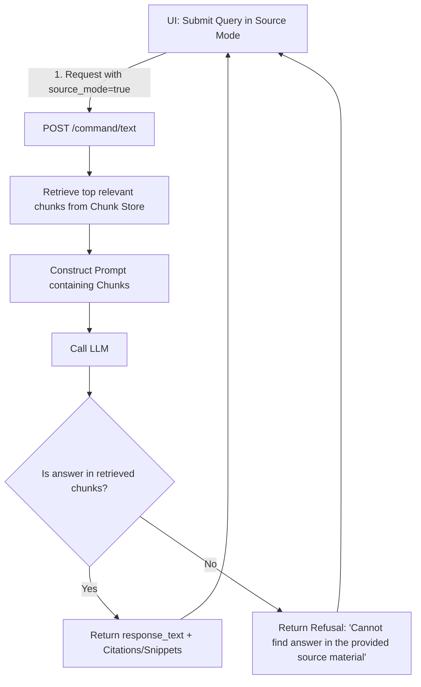

# Product Specification: Source-Grounded Answering & Animated Learning Handoff

This specification details the design and implementation phases for adding two new capabilities to the Shiksha Sahayak AI Teaching Assistant:
1. **Source-Grounded Answering** (from uploaded PDFs, text files, URLs, and pasted text).
2. **Animated Learning Handoff** (an external redirection to NotebookLM with a prewritten prompt payload).

---

## Architectural Constraints & Design Principles

To maintain the reliability and utility of the existing classroom smart-board system, the following design constraints must be strictly adhered to:
1. **Intact Classroom Assistant**: The core intent detection, fallback database logic, and voice/audio synthesis loops for the standard assistant must remain fully functional.
2. **Non-destructive normal mode**: Normal explain/quiz mode (utilizing fallback databases or general LLM knowledge) must remain the default unless Source Mode is explicitly enabled.
3. **Explicit Source Mode**: Source Mode must be separate, explicit, and toggleable. When enabled, the model must restrict its answers *only* to the ingested documents.
4. **True External Handoff**: The "Animated Learning" feature must be treated strictly as an external learning handoff. It redirects the teacher to Google NotebookLM with a prewritten prompt containing the current topic, grade level, and context, rather than attempting to clone or mock NotebookLM internally.

---

## Phase 1: Source Ingestion

### Objective
Build an upload and text extraction pipeline for PDFs, text files, URLs, and pasted text. Extract and save metadata for each source.

### API Specifications

#### 1. Ingest PDF or Text File
- **Endpoint**: `POST /sources/upload`
- **Payload**: `multipart/form-data` containing `file: UploadFile`
- **Behavior**: Detect mime-type. Use a PDF parsing library (e.g. `pypdf` or `pdfplumber`) to extract raw text.

#### 2. Ingest URL
- **Endpoint**: `POST /sources/add-url`
- **Payload**: `application/json`
  ```json
  {
    "url": "string"
  }
  ```
- **Behavior**: Scrape the webpage content (using `BeautifulSoup` or `httpx`), stripping out scripts, styling, and navigation blocks to isolate the main body text.

#### 3. Ingest Pasted Text
- **Endpoint**: `POST /sources/add-text`
- **Payload**: `application/json`
  ```json
  {
    "title": "string",
    "text": "string"
  }
  ```

#### 4. Source Listing & Metadata
- **Endpoint**: `GET /sources`
- **Response**: List of active sources with metadata:
  ```json
  [
    {
      "id": "uuid-string",
      "title": "string",
      "type": "pdf | url | text",
      "page_count": "number (optional)",
      "origin_url": "string (optional)",
      "language": "string",
      "created_at": "datetime"
    }
  ]
  ```

---

## Phase 2: Chunk & Index

### Objective
Split extracted source text into semantically cohesive, retrieval-friendly chunks and store them in a lightweight indexing layer.

### Technical Design

#### 1. Chunking Strategy
- **Chunk Size**: 500-800 characters.
- **Overlap**: 100 characters to prevent loss of context across boundaries.
- **Metadata**: Each chunk must carry:
  - `chunk_id`: UUID
  - `source_id`: UUID of the parent document
  - `page_number`: integer (if extracted from PDF)
  - `section_label`: string (if headers can be parsed)

#### 2. Retrieval Layer
- **Endpoint / Service Function**: `retrieve_chunks(query: str, limit: int = 3) -> List[Chunk]`
- **Mechanism**:
  - If a vector store (e.g. ChromaDB or SQLite-vec) is configured, perform dense embedding retrieval.
  - If no vector store is present, implement a deterministic **TF-IDF Keyword Matching / BM25** search using `rank_bm25` or SQLite Full-Text Search (FTS5).
  - Retrieval must return the top relevant chunks ordered by relevance score.

---

## Phase 3: Source-Grounded Answering

### Objective
Enforce strict boundaries so that when Source Mode is active, the LLM answers queries *only* using the retrieved chunks.

### Verification Flow



### Prompt Engineering & Guidelines
When `source_mode` is enabled, the system prompt must be formatted as follows:

```markdown
You are a source-grounded classroom assistant.
You are provided with the following source snippets:
===
{RETRIEVED_CHUNKS}
===

Your task is to answer the teacher's query: "{USER_QUERY}"
STRICT RULES:
1. Base your answer ONLY on the provided source snippets.
2. If the answer is not contained within the snippets, you must respond exactly with:
   "I cannot find the answer to this question in the provided source material."
3. Do NOT use general knowledge or assumptions.
4. If the query asks for an explanation, keep it simple. If it asks for a quiz, generate questions ONLY based on facts in the source snippets.
```

### JSON Schema Updates
When `source_mode` is enabled, the response from `/command/text` or `/command/audio` must include a `citations` array:
```json
{
  "mode": "explain | quiz",
  "title": "string",
  "response_text": "string",
  "language_mode": "hinglish | english | hindi",
  "citations": [
    {
      "source_title": "string",
      "snippet": "string",
      "page_number": "number (optional)"
    }
  ]
}
```

---

## Phase 4: Animated Learning Handoff (NotebookLM Integration)

### Objective
Provide a premium, animated transition in the UI that launches Google NotebookLM with a prewritten instruction payload, empowering teachers to transition to deep-dive reading guides or audio overviews.

### Technical Design

#### 1. Handoff Trigger
- A new interactive button/card titled **"Launch NotebookLM Study Guide"** will be displayed in the smart-board UI when in Source Mode.
- On click, it triggers a premium CSS animation sequence (e.g., zoom-in/warp transition mimicking a "handoff" portal).

#### 2. NotebookLM Redirection Payload
- NotebookLM does not support a direct API ingestion endpoint; therefore, the system redirects the teacher to the NotebookLM landing console (`https://notebooklm.google/`) or a preconfigured shared workspace.
- The browser automatically copies a prewritten structured prompt to the clipboard so the teacher can paste it directly:
  ```markdown
  Create a study guide and an audio podcast outline for the topic: '{TOPIC}' at Grade Level '{GRADE_LEVEL}' using the uploaded classroom source documents. Include Haryana-local analogies to explain key terms.
  ```
- A toast notification informs the teacher: *"Topic prompt copied to clipboard! Paste it inside NotebookLM to begin."*
